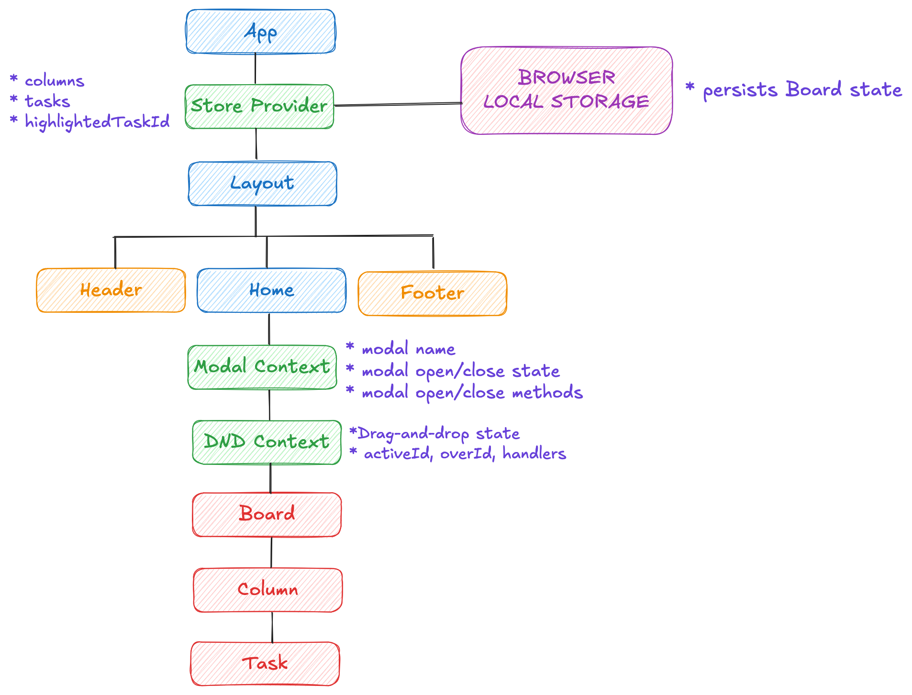

# Scrum Board – Task Manager
This is a [Next.js](https://nextjs.org) project bootstrapped with [`create-next-app`](https://nextjs.org/docs/app/api-reference/cli/create-next-app).

## Getting Started

First, run the development server:

```bash
npm run dev
# or
yarn dev
# or
pnpm dev
# or
bun dev
```

Open [http://localhost:3000](http://localhost:3000) with your browser to see the result.

## Live Preview
[Visit This Link](https://scrum-board-gilt.vercel.app/)

## Storybook Live Preview
[Visit This Link](https://683ec758e62e0609827e08f9-zbqmbfjahv.chromatic.com)

## Running Storybook

To start the Storybook development server:

```bash
npm run build-storybook && npm run storybook
# or
yarn build-storybook && yarn storybook
# or
pnpm build-storybook && pnpm storybook
# or
bun build-storybook && bun storybook
```

Storybook will be available at http://localhost:6006

## High Level Overview


## Features

A simple Scrum Board inspired by Trello, built with Next.js, TypeScript, Redux Toolkit, Tailwind CSS, and local storage.
-  Three Default Columns: To Do, In Progress, Done
- Add tasks to any column
- Edit and delete tasks
- Drag and drop tasks between columns
- Persist board data in localStorage
- Edit tasks via modal with input
- Filter tasks with real-time search: Implemented with controlled input and filter() over Redux state. Lightweight and reactive way, there is no need for search libraries in a small-scale app.
- Populate board with tasks from public API: Uses Redux createAsyncThunk for fetching and dispatching tasks. Better than fetching directly in components, keeps side effects centralized and testable.
- Accessibility considerations: Custom hooks like useHandleKeys and useOutsideClick + proper role, aria-labelledby, and aria-describedby.
- Add, rename, and delete dynamic columns (except the default ones). Deleted column's tasks move to "To Do": Tracked via Redux with task reassignment logic for deletion.
